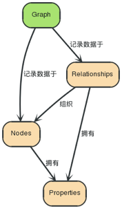

### Neo4j
+ 它包括如下几个显著特点:
+ 完整的ACID支持
+ 高可用性
+ 轻易扩展到上亿级别的节点和关系
+ 通过遍历工具高速检索数据

#### 图数据库
+ 图数据库用图来存储数据，是最接近高性能的一种用于存储数据的数据结构方式之一。
##### 一个图由无数的节点和关系组成
+ “一张图 – 数据记录在 → 节点 → 包括的 → 属性里面” 最简单的图是单节点的，一个记录，记录了一些属性。一个节点可以从单属性开始，成长为成千上亿，虽然会有一点点麻烦。从某种意义上讲，将数据用关系连接起来分布到不同节点上才是有意义的。

##### 关系将图各个部分组织起来
+ “节点 — 被组织 → 关系 — 可以有 → 属性” 关系可以将节点组织成任意的结构，允许一张图被组织成一个列表，一棵树，一张地图，或者一个复杂的实体 – 这个实体本身也是由复杂的，关系高度关联的结构组成。
##### 用 Traversal 进行数据库查询
+ “一个 Traversal — 导航 → 一张图; 他 — 标示 → 路径 — 包含 → 节点” 一次 Traversal, 你可以理解为是你通过一种算法，从一些开始节点开始查询与其关联的节点，比如你想找到 “我朋友喜欢但我不喜欢的那首音乐是什么呢？”，又或者 “如果断电了，拿下服务器的服务会首影响？”等等问题。

##### 为节点和关系建立索引
+ “一个索引 — 映射到 → 属性 — 属于 → 节点或者关系” 经常，你想通过某一给定的属性值找到节点或者关系。比起通过遍历我们的图来书，用索引将会更加高效。比如“找到用户名是tony的用户”。

##### Neo4j是一个图数据库
+ “一个图数据库 — 管理 → 一张图 和与图相关的 → 索引” Neo4j是一个有商业支持的开源图数据库。他被设计来用于拿下数据不断高速成长的数据存储，用高效的图数据结构代替传统的表设计。

### Neo4j图数据库
#### 节点
+ 构成一张图的基本元素是节点和关系。在Neo4j中，节点和关系都可以包含属性。 节点经常被用于表示一些实体，但依赖关系也一样可以表示实体。

#### 关系
+ 节点之间的关系是图数据库很重要的一部分。通过关系可以找到很多关联的数据，比如节点集合，关系集合以及他们的属性集合。
  

+ 一个关系连接两个节点，必须有一个开始节点和结束节点。
  

+ 因为关系总是直接相连的，所以对于一个节点来说，与他关联的关系看起来有输入/输出两个方向，这个特性对于遍历图非常有帮助
  

+ 关系在任一方向都会被遍历访问。这意味着我们并不需要在不同方向都新增关系。
+ 而关系总是会有一个方向，所以当这个方向对你的应用没有意义时你可以忽略方向。

#### 属性
+ 节点和关系都可以设置自己的属性。 属性是由Key-Value键值对组成，键名是字符串。属性值是要么是原始值，要么是原始值类型的一个数组。比如+String+，+int+和i+int[]+都是合法的。null不是一个合法的属性值。 Nulls能代替模仿一个不存在的Key。
  

#### 路径
+ 径由至少一个节点，通过各种关系连接组成，经常是作为一个查询或者遍历的结果。
  

#### 遍历（Traversal）
+ 遍历一张图就是按照一定的规则，跟随他们的关系，访问关联的的节点集合。最多的情况是只有一部分子图被访问到，因为你知道你对那一部分节点或者关系感兴趣。Neo4j提供了遍历的API，可以让你指定遍历规则。最简单的设置就是设置遍历是宽度优先还是深度优先。
+ 想对遍历框架有一个深入的了解，请参考章节：tutorial-traversal。
+ 想了解更多的Java代码范例，请参考章节：tutorials-java-embedded-traversal。
+ 其他查询图的方式还有cypher-query-lang, Cypher和gremlin-plugin, Gremlin。# knowledge_graph
